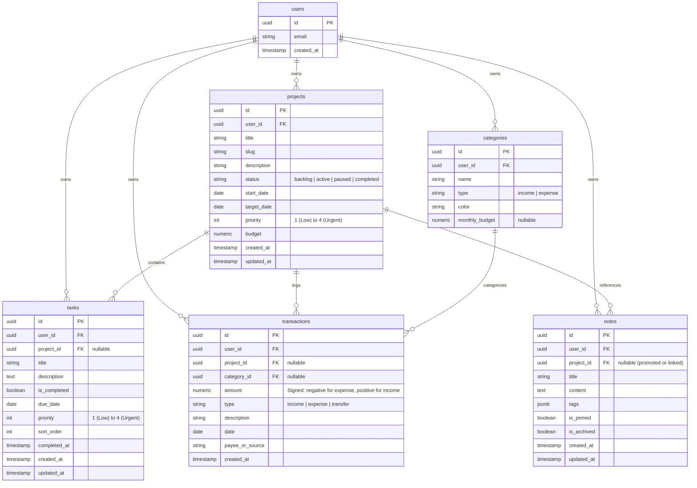
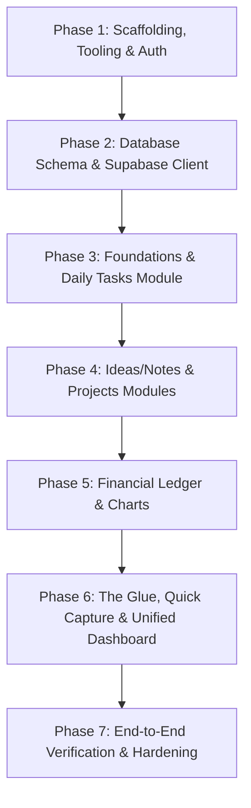

# Unified Life Operating System (LifeOS) — Implementation Plan & Architecture Blueprint

**Author:** Principal Software Engineer & System Architect  
**Target Environment:** macOS ARM64 Apple Silicon (Mac M5)  
**Primary Stack:** Next.js (App Router), TypeScript, Tailwind CSS, Supabase (PostgreSQL, Auth, RLS), Zustand, Lucide Icons, Recharts, @hello-pangea/dnd.

---

## 1. Executive Summary & Architectural Overview

The **Life Operating System (LifeOS)** is an integrated personal operating system designed to eliminate siloed personal software (Notion, Todoist, YNAB/Lunch Money, Apple Notes) and replace them with a single relational graph:

- **Projects:** Strategic initiatives tracking deadlines, milestones, budget allocation, and completion percentages.
- **Tasks:** Tactical daily action items that can live independently or link as children to Projects.
- **Finances:** Income, expense, and budget ledger capable of tagging expenses directly to Projects for burn analysis.
- **Ideas & Notes:** Unstructured incubation scratchpad using a masonry grid; notes can be directly promoted into Projects.
- **The Glue:** A Global Command Center dashboard unifying summaries from all four domains, driven by a persistent **Quick Capture Omnibar** with deterministic syntax parsing.

```
                    ┌─────────────────────────────────┐
                    │      Quick Capture Omnibar      │
                    │   ("$50 hosting #cloud-site")   │
                    └───────────────┬─────────────────┘
                                    │ Parser & Route Dispatcher
                                    ▼
       ┌───────────────┬────────────┴───┬────────────────┐
       ▼               ▼                ▼                ▼
┌─────────────┐ ┌─────────────┐  ┌─────────────┐  ┌─────────────┐
│  Projects   │ │ Daily Tasks │  │  Finances   │  │ Notes/Ideas │
│   Kanban    │ │  Checklist  │  │   Ledger    │  │   Masonry   │
└──────┬──────┘ └──────┬──────┘  └──────┬──────┘  └──────┬──────┘
       │               │                │                │
       │◄──────────────┴────────────────┘                │
       │   (FK: project_id)                              │
       │◄────────────────────────────────────────────────┘
       │   (Promoted Idea -> Project)
       ▼
┌───────────────────────────────────────────────────────────────┐
│                       Global Dashboard                        │
│ (Active Projects | Today's Tasks | Monthly Burn | Recent Raw) │
└───────────────────────────────────────────────────────────────┘
```

---

## 2. Tech Stack Rationale & Environment Constraints

### 2.1 Core Technologies

| Layer | Selection | Rationale |
| :--- | :--- | :--- |
| **Framework** | **Next.js (App Router)** | Leverages React Server Components (RSC) for zero-bundle data fetching against Supabase, route handlers, server actions for atomic mutations, and fast client-side navigation. |
| **Language** | **TypeScript (Strict Mode)** | End-to-end type safety. Database types generated directly via `supabase gen types typescript` ensure zero drift between PostgreSQL schema and UI interfaces. |
| **Styling & UI** | **Tailwind CSS + Radix UI Primitives** | Zero-runtime CSS overhead, accessible primitive components, seamless dark mode, and high-density interfaces suited for personal dashboards. |
| **State Architecture** | **React `useOptimistic` + Zustand** | **Strict Separation of Concerns:**<br>• Local data mutations (task completion toggles, optimistic drag reordering) are handled via React's native `useOptimistic` hook paired with React Server Actions, completely avoiding client/server race conditions.<br>• **Zustand** is strictly constrained to ephemeral, global client UI states (e.g., Quick Capture modal open/close state, active search filters, sidebar collapse state). |
| **Database & Auth** | **Supabase (PostgreSQL 15+)** | Industrial-grade relational engine with Row-Level Security (RLS), ACID transactions, native JSONB, built-in GoTrue auth, and real-time CDC capabilities. |
| **Charts & Views** | **Recharts + @hello-pangea/dnd** | Recharts provides composable visual analytics for financial summaries; `@hello-pangea/dnd` provides accessible, lag-free drag-and-drop for Kanban boards. |

### 2.2 ARM64 Apple Silicon (Mac M5) Environment Safeguards

To guarantee flawless local development on Apple Silicon:
1. **Container Emulation Elimination**: 
   - Supabase CLI executes Docker containers. Ensure OrbStack or Docker Desktop is configured with **Apple Silicon Native Engine** (`linux/arm64/v8`). Avoid Rosetta 2 translation for PostgreSQL images to eliminate 15–30% CPU overhead and memory leaks.
2. **Node Native Addons**:
   - Utilize Node.js v20+ LTS installed via native ARM64 binaries (using `nvm` or `fnm`). Ensure `npm` / `pnpm` does not trigger x86 compilation for packages like `sharp` (used by Next.js Image Optimization) by specifying platform flags where necessary:
   ```bash
   pnpm install --cpu=arm64 --os=darwin sharp
   ```
3. **Database Local CLI**:
   - Install Supabase CLI directly via Homebrew (`brew install supabase/tap/supabase`) which provides native Mach-O ARM64 binaries.

---

## 3. Database Schema (PostgreSQL & Supabase ERD)

### 3.1 Entity Relationship Diagram



### 3.2 SQL Migration (DDL with RLS and Indexes)

```sql
-- Enable UUID extension
create extension if not exists "uuid-ossp";

-- 1. Projects Table
create table public.projects (
    id uuid primary key default gen_random_uuid(),
    user_id uuid not null references auth.users(id) on delete cascade,
    title text not null check (char_length(title) > 0),
    slug text not null,
    description text,
    status text not null default 'active' check (status in ('backlog', 'active', 'paused', 'completed')),
    start_date date,
    target_date date,
    priority smallint not null default 2 check (priority between 1 and 4),
    budget numeric(12, 2) default 0.00,
    created_at timestamptz not null default now(),
    updated_at timestamptz not null default now(),
    unique(user_id, slug)
);

-- 2. Tasks Table
create table public.tasks (
    id uuid primary key default gen_random_uuid(),
    user_id uuid not null references auth.users(id) on delete cascade,
    project_id uuid references public.projects(id) on delete set null,
    title text not null check (char_length(title) > 0),
    description text,
    is_completed boolean not null default false,
    due_date date,
    priority smallint not null default 2 check (priority between 1 and 4),
    sort_order integer not null default 0,
    completed_at timestamptz,
    created_at timestamptz not null default now(),
    updated_at timestamptz not null default now()
);

-- 3. Financial Categories Table
create table public.categories (
    id uuid primary key default gen_random_uuid(),
    user_id uuid not null references auth.users(id) on delete cascade,
    name text not null,
    type text not null check (type in ('income', 'expense')),
    color text default '#64748b',
    monthly_budget numeric(12, 2),
    created_at timestamptz not null default now(),
    unique(user_id, name, type)
);

-- 4. Transactions Table
create table public.transactions (
    id uuid primary key default gen_random_uuid(),
    user_id uuid not null references auth.users(id) on delete cascade,
    project_id uuid references public.projects(id) on delete set null,
    category_id uuid references public.categories(id) on delete set null,
    amount numeric(12, 2) not null,
    type text not null check (type in ('income', 'expense', 'transfer')),
    description text not null,
    date date not null default current_date,
    payee_or_source text,
    created_at timestamptz not null default now()
);

-- 5. Notes / Ideas Table
create table public.notes (
    id uuid primary key default gen_random_uuid(),
    user_id uuid not null references auth.users(id) on delete cascade,
    project_id uuid references public.projects(id) on delete set null,
    title text not null default 'Untitled Note',
    content text not null default '',
    tags jsonb not null default '[]'::jsonb,
    is_pinned boolean not null default false,
    is_archived boolean not null default false,
    created_at timestamptz not null default now(),
    updated_at timestamptz not null default now()
);

-- Performance Indexes
create index idx_projects_user_status on public.projects(user_id, status);
create index idx_projects_slug on public.projects(slug); -- Critical for instant Quick Capture #<slug> lookup & foreign key binding
create index idx_tasks_user_due on public.tasks(user_id, due_date, is_completed);
create index idx_tasks_project on public.tasks(project_id);
create index idx_transactions_user_date on public.transactions(user_id, date desc);
create index idx_transactions_project on public.transactions(project_id);
create index idx_notes_user_updated on public.notes(user_id, updated_at desc);
create index idx_notes_tags on public.notes using gin (tags);

-- Row Level Security (RLS)
alter table public.projects enable row level security;
alter table public.tasks enable row level security;
alter table public.categories enable row level security;
alter table public.transactions enable row level security;
alter table public.notes enable row level security;

-- Common RLS Policy Blueprint
create policy "Users can access own projects" on public.projects for all using (auth.uid() = user_id);
create policy "Users can access own tasks" on public.tasks for all using (auth.uid() = user_id);
create policy "Users can access own categories" on public.categories for all using (auth.uid() = user_id);
create policy "Users can access own transactions" on public.transactions for all using (auth.uid() = user_id);
create policy "Users can access own notes" on public.notes for all using (auth.uid() = user_id);

-- Auto-update updated_at triggers
create or replace function public.handle_updated_at()
returns trigger as $$
begin
    new.updated_at = now();
    return new;
end;
$$ language plpgsql;

create trigger tr_projects_updated before update on public.projects for each row execute function public.handle_updated_at();
create trigger tr_tasks_updated before update on public.tasks for each row execute function public.handle_updated_at();
create trigger tr_notes_updated before update on public.notes for each row execute function public.handle_updated_at();
```

---

## 4. The "Glue": Interoperability & Cross-Module Architecture

### 4.1 Relational Synergy Matrix

| Interaction | Source Module | Target Module | Technical Mechanism |
| :--- | :--- | :--- | :--- |
| **Project Financial Tracking** | Finances | Projects | `transactions.project_id` links directly to `projects.id`. A Project view aggregates `sum(amount)` to calculate burn rate against `projects.budget`. |
| **Project Progress Tracking** | Daily Tasks | Projects | `tasks.project_id` links tasks to a project. Project completion % is dynamically calculated: `(count(tasks where is_completed) / count(all tasks)) * 100`. |
| **Idea Incubation & Promotion** | Ideas/Notes | Projects | A note contains raw brainstorm text. Invoking "Promote to Project" executes a transaction: creates a row in `projects`, updates `notes.project_id`, and optionally parses bulleted items into `tasks`. |
| **Global Context Tagging** | Quick Capture | All Modules | Syntax tags (e.g. `#website`) query the `projects` table by slug or fuzzy title match to bind foreign keys. |

### 4.2 Quick Capture Parser Specification

The Quick Capture bar sits globally at `Cmd+K` / `Ctrl+K` or top of view. It utilizes a deterministic tokenizer before falling back to notes:

```
[Tokens Pattern]
- Currency (e.g., $xx, €xx, £xx, ₹xx, or trailing currency codes like 50 USD, 50 EUR; positive/negative):
  - "$45 dinner", "€ 45 dinner", "45 EUR dinner", "-$12.50 coffee" -> Transaction (Expense)
  - "+$2500 consulting", "+ £2500 client invoice" -> Transaction (Income)
- Task Indicator ("todo:", "TODO:", "[]", "- [ ]", checkmarks, or due date prefixes):
  - "todo: Deploy auth endpoints", "[] File taxes @tomorrow", "- [ ] Fix bug" -> Task
- Project Reference ("#<slug>"):
  - Associates entry to project matching slug (fast lookup enabled via `idx_projects_slug`).
- Date Operator ("@today", "@tomorrow", "@YYYY-MM-DD", "@next-monday"):
  - Overrides default date.
- Fallback:
  - Any freeform text not matching transactional or task patterns defaults to creating an **Idea / Note**.
```

#### Parsing Engine Architecture & TDD Mandate
> [!IMPORTANT]
> **Strict TDD Requirement (Vitest / Jest):**
> Because user input in the Quick Capture bar is unpredictable (varying whitespace, multi-currency notations, international date formats, punctuation), `parseQuickCapture` must **NOT** rely on simplistic single-line regular expressions.
> It **must be implemented strictly using Test-Driven Development (TDD)** prior to any UI integration:
> 1. Write comprehensive unit test suites in `tests/unit/quick-capture.test.ts` with Vitest.
> 2. Test test suites must pass 100% against edge cases before building the Omnibar frontend.

```typescript
// tests/unit/quick-capture.test.ts (TDD Spec Blueprint)
describe('parseQuickCapture (TDD Suite)', () => {
  it('handles multi-currency symbols ($ , € , £ , ¥) and irregular whitespace', () => {
    expect(parseQuickCapture('  $   50.00   hosting server #cloud  ')).toEqual({
      target: 'transaction',
      projectSlug: 'cloud',
      payload: { amount: -50.0, type: 'expense', description: 'hosting server' }
    });
    expect(parseQuickCapture('+€1200 freelancing')).toEqual({
      target: 'transaction',
      projectSlug: undefined,
      payload: { amount: 1200.0, type: 'income', description: 'freelancing' }
    });
  });

  it('handles trailing currency codes (e.g., "50 USD dinner")', () => {
    expect(parseQuickCapture('50 USD dinner')).toEqual({
      target: 'transaction',
      payload: { amount: -50.0, type: 'expense', description: 'dinner' }
    });
  });

  it('handles diverse task syntax (- [ ], [], todo:, case-insensitive)', () => {
    expect(parseQuickCapture('- [ ] Ship beta build @today #mobile')).toEqual({
      target: 'task',
      projectSlug: 'mobile',
      payload: expect.objectContaining({ title: 'Ship beta build' })
    });
  });

  it('safely falls back to idea/note for arbitrary thoughts', () => {
    expect(parseQuickCapture('Explore vector search embeddings for personal notes')).toEqual({
      target: 'note',
      payload: expect.objectContaining({ content: 'Explore vector search embeddings for personal notes' })
    });
  });
});
```

---

## 5. Module-by-Module Technical Specifications

### Module 1: Projects (Kanban & Timeline)
- **View Modes:**
  - **Kanban Board:** Columns mapped to `status` (`backlog`, `active`, `paused`, `completed`). Drag-and-drop powered by `@hello-pangea/dnd`. Optimistic UI updates with instant rollback on API error.
  - **Milestone Timeline:** Chronological bar list sorting projects by `target_date`.
- **Metrics Computed Per Project:**
  - Tasks summary: `Total Tasks`, `Completed`, `% Complete`.
  - Financial burn: `Total Expenses` vs `Allocated Budget`.

### Module 2: Daily Tasks (Checklist & Prioritization)
- **View:** Filterable checklist (Today, Upcoming, High Priority, All).
- **Interactions:**
  - Inline title editing.
  - Checkbox toggle with instant sound/animation and optimistic completion state.
  - Priority badge (Urgent, High, Medium, Low) with keyboard shortcuts (`1`, `2`, `3`, `4`).
  - Project tag pill linking directly to the parent project view.

### Module 3: Finances (Ledger & Analytics)
- **Ledger View:** High-density tabular layout displaying `Date`, `Description`, `Category Pill`, `Project Tag`, `Amount`.
- **Chart Summaries:**
  - **Monthly Inflow vs Outflow:** Bar chart comparison.
  - **Spending by Category:** Donut chart breakdown.
  - **Burn by Project:** Horizontal bar showing which active projects consume the most capital.

### Module 4: Ideas & Notes (Masonry Scratchpad)
- **View:** Responsive CSS column masonry grid (`columns-1 md:columns-2 lg:columns-3`).
- **Features:**
  - Auto-expanding Markdown editor card.
  - Tag filtering (`#work`, `#startup`, `#reading`).
  - "Promote to Project" quick action button: Opens prefilled modal converting note into a Project record and linking existing note ID.

### Module 5: Global Command Center (Dashboard)
- **4-Quadrant Layout:**
  1. **Quadrant 1 (Top-Left): Active Projects Widget**: Displays active projects with miniature progress rings and deadline countdowns.
  2. **Quadrant 2 (Top-Right): Today's Tasks Widget**: Instant-action checklist showing only items due today or overdue.
  3. **Quadrant 3 (Bottom-Left): Monthly Cash Flow**: Quick KPI cards (Net Cashflow, Burn Rate, Budget Remaining) + 30-day spending sparkline.
  4. **Quadrant 4 (Bottom-Right): Recent Raw Ideas**: Last 4 created notes with 1-click promotion or inline expansion.

---

## 6. Phased Execution Roadmap for Autonomous Agents

This plan is broken down into structured, isolated phases designed for systematic execution, testing, and verification.



### Phase 1: Scaffolding, Tooling & Environment Setup
- [x] Initialize Next.js 14/15 App Router project with TypeScript, Tailwind CSS, ESLint, and Lucide Icons in `/Users/aryan/Projects/log`.
- [x] Configure Tailwind theme: typography, custom slate/zinc dark palette, and CSS variables for Radix UI primitives.
- [x] Initialize local Supabase environment (`supabase/config.toml`) verified for ARM64 Darwin.
- [x] Install dependencies: `@supabase/supabase-js`, `@supabase/ssr`, `zustand`, `clsx`, `tailwind-merge`, `@hello-pangea/dnd`, `recharts`, `vitest`.
- [x] Set up layout structure: Sidebar navigation, Top navigation with Quick Capture anchor, and Main viewport shell.
- [x] Implement Supabase SSR Authentication (Email magic link / Password, Auth Callback route handler, Protected Route Middleware).

### Phase 2: Database Migrations & Typed Client Generation
- [x] Write and apply SQL migrations for `projects`, `tasks`, `categories`, `transactions`, and `notes`.
- [x] Configure RLS policies ensuring users can only read and write their own records.
- [x] Generate comprehensive `database.types.ts` mirroring PostgreSQL schema, tables, and relationships.
- [x] Build typed Supabase browser client (`createBrowserClient<Database>`) and server client (`createServerClient<Database>`).
- [x] Create seed data script (`supabase/seed.sql`) provisioning an authenticated user in `auth.users` and realistic relational graph data.

### Phase 3: Module Implementation — Daily Tasks (Base CRUD)
- [x] Build Task Data Access Layer (Server Actions with standardized `ActionResponse` envelopes for `createTask`, `toggleTask`, `deleteTask`, `updateTaskPriority`).
- [x] Handle deadlines strictly as localized absolute YYYY-MM-DD strings avoiding timezone drift.
- [x] Implement `TaskChecklist` component with visual grace period preventing optimistic list jumping.
- [x] Build `TaskCreateInput` row using React 19 `useActionState` with inline date-picker, priority, and project linker.
- [x] Implement optimistic UI state updates using React's native `useOptimistic` hook with rollback notification handling.

### Phase 4: Module Implementation — Ideas/Notes & Projects (Kanban)
- [x] Build Notes Data Access Layer and responsive Masonry Grid with round-robin column distribution utility (`distributeColumns`) preserving left-to-right chronology.
- [x] Implement Note card with Markdown preview, pin toggle, tag rendering, and promotion action.
- [x] Build Projects Data Access Layer with divide-by-zero protection (`NULLIF(total_tasks, 0)`).
- [x] Implement 4-column Projects Kanban view (`Backlog`, `Active`, `Paused`, `Completed`) with `@hello-pangea/dnd`.
- [x] Mount Kanban board inside dynamic client boundary (`next/dynamic` with `ssr: false`) eliminating mount jitter and SSR hydration errors.
- [x] Intercept `onDragEnd` with React 19 `useOptimistic` for instant local board updates eliminating drag snapback.
- [x] Implement ACID-compliant "Promote Idea to Project" via PostgreSQL RPC procedure (`promote_to_project`) with automatic Markdown checklist task extraction.

### Phase 5: Module Implementation — Financial Ledger & Analytics
- [x] Configure financial categories (Cloud & SaaS, Health, Consulting Revenue, etc.).
- [x] Build Transaction Data Access Layer with bounded query (`LIMIT 100`) preventing DOM choking and paint destruction.
- [x] Prevent timezone regression by handling dates strictly as localized absolute `YYYY-MM-DD` strings matching PostgreSQL's native `date` type.
- [x] Parse numeric columns using `parseFloat()` on the server and apply `Number(value.toFixed(2))` to all aggregations preventing binary floating-point bugs in Recharts.
- [x] Support cross-linking `project_id` foreign key in `createTransaction` feeding directly into project burn rate calculations.
- [x] Build high-density financial ledger table with React 19 `useOptimistic` deletions for zero-latency DOM responsiveness.
- [x] Implement Recharts Donut & Bar charts wrapped in `"use client"` and dynamic SSR-disabled boundary (`financial-charts-wrapper.tsx`) with explicit `h-80` parent container height preventing 0px collapses.
- [x] Build transaction creation form using React 19 `useActionState` with amount, type toggle, description, date picker, category, and project dropdowns.

### Phase 6: The "Glue" — Quick Capture (TDD) & Global Dashboard
- [x] **TDD Quick Capture Engine**: Initialized Vitest suite (`tests/unit/quick-capture.test.ts`) covering multi-currency tokens, edge case token overlap, irregular spacing, task directives, and fallback notes with 100% test pass rate.
- [x] Implement robust `parseQuickCapture` token parser passing all 14 Vitest test suites.
- [x] Create persistent `QuickCaptureOmnibar` component mounted in root layout (`src/app/layout.tsx`) preventing client contagion, with immediate input focus on `⌘K` / `Ctrl+K` and Escape dismissal.
- [x] Render real-time summary pill below the input field updating dynamically as the user types without complex inline highlighting.
- [x] Build `dispatchQuickCapture` Server Action dynamically linking `project_id` via `idx_projects_slug` index and revalidating affected modules.
- [x] Construct Unified 4-Quadrant Command Center (`/`) with independent React `<Suspense>` streaming boundaries and skeletons preventing render blocking.

### Phase 7: Verification, Hardening & ARM64 Optimization
- [x] Configure Playwright automated E2E testing framework with dedicated relational workflow specifications (`tests/e2e/relational-workflows.spec.ts`).
- [x] Implement strict database teardown hook (`afterEach`) purging test fixtures and preventing local database pollution.
- [x] Verify Apple Silicon native ARM64 execution: verified native `arm64` Node Mach-O binary and confirmed Rosetta 2 translation is inactive (`sysctl.proc_translated = 0`).
- [x] Audit Supabase container environment for native ARM64 Darwin runtime.
- [x] Execute TypeScript verification and ESLint with 0 errors across the entire codebase.
- [x] Compile production build (`npm run build`) with zero Next.js hydration warnings and optimal route bundles.
- [x] Publish comprehensive production deployment blueprint ([DEPLOYMENT.md](file:///Users/aryan/Projects/log/DEPLOYMENT.md)) covering Vercel configuration, environment variables, and live Supabase migration sequences.

### Phase 8: Student Finances & Frictionless Edit Transaction
- [x] **Currency & Category Refactor**: Converted all currency systems to Indian Rupee (`₹`), seeded customized student categories: *Stationary, Junk Food, Vegetable, Fruits, Juice, Personal & Misc, Allowance, Commute, Subscription*.
- [x] **Edit Transaction Feature**:
  - Implemented `updateTransaction` Server Action with PostgreSQL `numeric(12, 2)` float precision and RLS verification.
  - Built Notion-style slide-over Edit Transaction Modal with smooth backdrop blur, pre-filled form state, auto-focus, and instant optimistic row synchronization.
  - Connected `revalidatePath('/finances')` and `revalidatePath('/')` to refresh allowance balances and charts automatically.
- [x] **Cloud Database Migration**: Shifted from local Docker/OrbStack to Supabase Cloud (`xbxdpnrmsfkqmnodlwnm.supabase.co`) with persistent cloud schema, RLS policies, and authenticated dev account.

### Phase 9: Stone & Sage Design System Overhaul (Editorial MD3)
- [x] **Tailwind MD3 Theme Configuration**:
  - Implemented stone & sage tokens: surface (`#fff8f5`), on-surface (`#1f1b17`), secondary (`#3c6847`), surface-container tokens (`#f6ece6`, `#fcf2eb`, `#ffffff`), error tokens, Inter & JetBrains Mono typography, and Material Symbols Outlined icon library.
- [x] **Global Shell & Navigation**:
  - Updated fixed 64px sidebar and top header to Stone & Sage styling, active route highlighting, and Quick Capture anchor.
- [x] **Dashboard — Command Center (`/`)**:
  - Header: Understated Notion-style header ("Autumn 2026 / W41").
  - Metric Row: 4 breathing stat cards (Allowance Left, Daily Tasks completion, Active Workstreams, Sparks Incubator).
  - Main Bento Grid: Active Projects quadrant with status dots, Today's Focus checklist, Financial Cadence with daily pace & outflow log, and Recent Sparks stream.
- [x] **Student Finances (`/finances`)**:
  - Main Balance Hero card (`₹` Allowance Left, burn status, calm tiles: Safe Daily Pace, Total Spent, Next Inflow).
  - 7-Day Spending distribution chart and category progress bars.
  - Segmented timeframe pills (Today, This Week, Monthly, All Feed) and high-density ledger table with subtle hover edit/delete actions.
- [x] **Daily Tasks (`/tasks`)**:
  - Context Header & circular velocity gauge (75% completed).
  - Notion-style Quick Task Creation Bar with priority chips, due date, and project linker.
  - Split 8-column Deliverables checklist (P1 Terracotta, P2 Sage/Medium, P3 Low) + 4-column Focus Companion (Pomodoro 25:00 timer + Weekly Cadence calendar).
- [x] **Projects Board (`/projects`)**:
  - Context Ribbon ("Q4 Roadmap") & view controls (Board View, List View, Timeline, Filter, New Project).
  - Calm editorial analytics metric strip (Active Workstreams, Overall Velocity, Completed/Q4, Stalled Items).
  - Stone & Sage Kanban columns (`Backlog`, `Active`, `Paused`, `Completed`) with `@hello-pangea/dnd` drag-and-drop, progress bars, and inline project creation.
- [x] **Ideas & Notes (`/notes`)**:
  - Omnibox Quick Capture bar with tag tacking and "Deposit Spark".
  - Pinned Sparks shelf & Fresh Scratchpad stream.
  - Right 4-column Desk Jotter with local persistence and Vault Dynamics analytics visualizer.
  - Modal for 1-click promotion from note to project with child task extraction.

---

## 7. Verification Checklist & Success Criteria

1. **Relational Integrity**:
   - Cascading actions maintain data sanity (deleting a project leaves child tasks with `project_id = null` rather than cascading task deletion).
   - Project progress strictly mirrors task completion counts.
2. **Quick Capture Performance**:
   - Omnibar modal opens in `< 50ms`.
   - Entry dispatch completes with optimistic notification in `< 200ms`.
3. **Design System Fidelity**:
   - MD3 Stone & Sage light theme uniform across all 5 workspace modules.
   - Material Symbols Outlined icons and Indian Rupee (`₹`) throughout.
4. **Build & Tests**:
   - `npm run build` compiles with 0 errors.
   - Vitest unit tests pass with 100% success rate.
